___

##**PRM Release MillFrame 4.2**

#***Client Publisher Console (CPC) User Guide***

___

Confidential and Proprietary

© 2017 Milliman, Inc. All rights reserved.\
Milliman® is a trademark of Milliman, Inc.\
All other trademarks belong to their respective owners

This manual and its contents are the confidential property of Milliman, Inc. and are prepared for the exclusive use of Milliman, Inc. and its subscribing clients. Any distribution or reproduction, intentional or unintentional, of any materials contained herein without the express written permission of Milliman, Inc. is prohibited.

For additional information, please contact our technical support team by email: <prm.support@milliman.com>

___

##Introduction

Milliman PRM Analytics is a predictive analytics solution that is used to identify potentially avoidable costs in populations under financial risk.

This user guide is designed to give users an understanding of the features of the PRM Client Publisher Module, the functionality of each section and step by step instructions for using the system.

Please note that these instructions are ONLY meant for internal users who have been granted administrator access.

*Note: Access to various functionality is dictated by what was enabled for the role assigned to the user and the options enabled for the client. For illustration purposes, all of the functionality is enabled in the screen shots shown below.*

##Technical Support

If you are having any technical difficulty with the product, please contact our technical support team by email: <prm.support@milliman.com>

*Note: For the purpose of this user guide, all data has been de-identified to protect patient’s personal health information (PHI) in accordance with the Health Insurance Portability and Accountability Act of 1996 (HIPAA).*

##PRM Client Publisher Console

###Overview

PRM Client Publisher Console (CPC) is an application that allows authorized users to publish updated content (Qlikview Reports) to the PRM production server. Publishing content means that it will be available to be viewed by authorized users. This functionality is limited to replacing an “existing” named report on the server. In the event “new” content (a QVW that has not previously been published) is required on the PRM server, a request should be directed to PRM support to create the initial containers for the new project, which can then be updated via the Client Publisher Console.

##Launching a Client Publisher Console

Login to the Web Portal at [prm.milliman.com](https://prm.milliman.com).

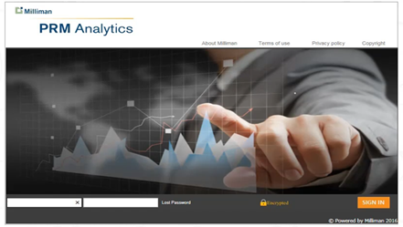{width=100% height=auto}\

Click on the Publish Content menu item. The content tab is visible **only** to users who are authorized to publish contents. If a user is authorized to publish contents for a single Project (normally one report) then clicking on Publish content will navigate the user to the Publish content page otherwise if a user is authorized to publish contents for multiple Projects then a drop down will be available to show each collection of reports.

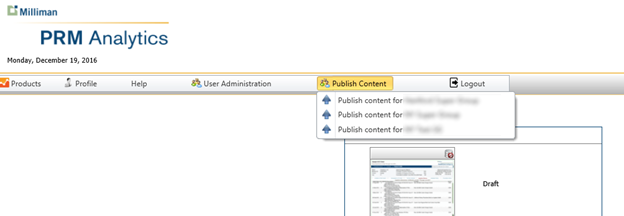{width=100% height=auto}\

Click on a specific menu item to navigate to the Client Publisher Console for that menu item. All associated reports for that menu item will be displayed in the Client Publisher Console main page.

{width=100% height=auto}\

##Client Publisher Console User Interface

###User Interface Layout Overview

The CPC user interface is organized into sections called ‘Projects’. A project will exist for each report that you have rights to publish. A project is a collection of all the items related to your report that will be displayed via the web portal or drives the behavior of the system as related to the report. Each project section is contained within a grouping box with the project title in the upper left hand corner. Each project container has identical functionality as other project containers on the same page, and differ only in the report and report artifacts for the particular report.

##Editing/Updating a Project

Click on Edit Project.

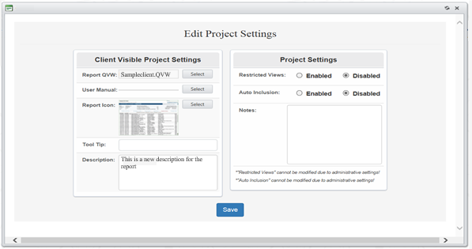{width=100% height=auto}\

An **Edit Project Settings** box opens where both **Client Visible Project Settings** and **Project Settings** may be viewed.\

The **Client Visible Project Settings** represents items visible via the web portal by users, these items consist of

  * The Report QVW
  * A User Manual
  * Tool Tip to help the user understand more details
  * A brief description of the QVW

**Project Settings** represents items that drive system behavior; these items are not directly viewable via the web portal by users.

  * Restricted Views
  * Auto Inclusion

A **Notes** field is also included to describe how the QVW has been edited or modified. In order to save changes, the **Client Publisher** hits the **Save** button.

##Publishing an updated report that is associated to a group contained in a Super Group

As previously mentioned, when you make changes in the **Client Visible Project Settings**, they are reflected in the **Report Display** in the Web Portal. The screen print below is added just for your information to show the corresponding section on Web Portal application.

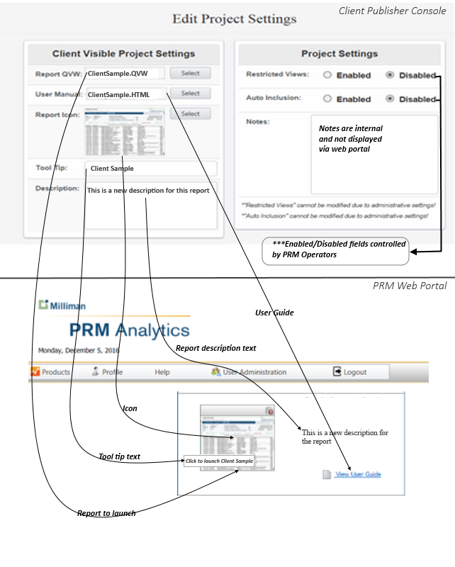{width=100% height=auto}\

##Review of stages of reports before being pushed to production

Click on the **Report QVW - Select** button to open the file upload browse control to upload the new QVW to the server.

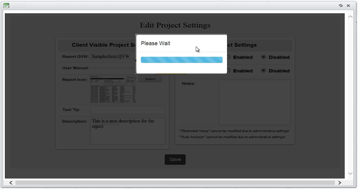{width=100% height=auto}\

Begin report processing

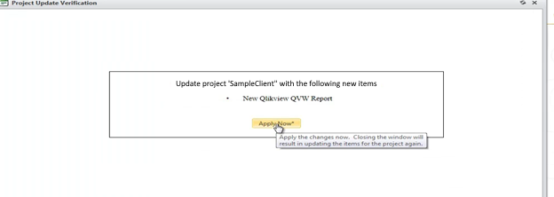{width=100% height=auto}\

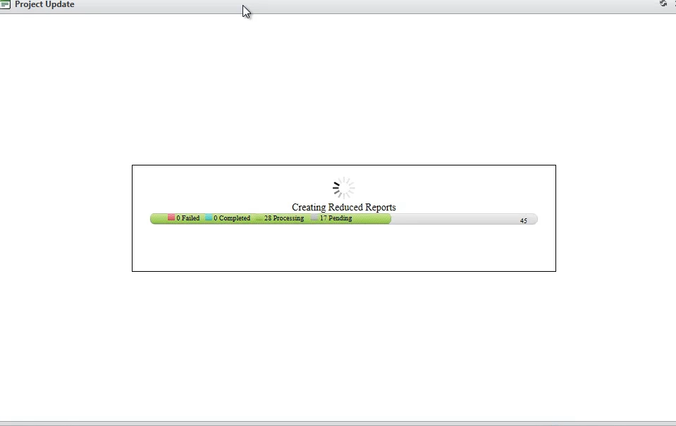{width=100% height=auto}\

Once started – report reduction takes a while to complete and is dependent upon the number of users and the complexity of the report being reduced.

The processing reduces a report for the selections of each user that exists in the group as applied to the master report just uploaded. The reduced report will be associated with the user’s account, such that the web portal will launch the reduced report (if available).

The blue portion of the bar indicates reports which have been processed while green represents accounts pending processing.

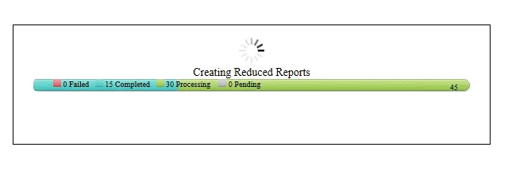{width=100% height=auto}\

After reduction processing is complete. A window with several tabs will be displayed. Each tab contains various status information as related to the reduction process.

The fifth tab is the “Review/Approval” tab. For this iteration of the processing user Jane User is missing the selection for “Sample Surgical, Inc(0000)”. Since this was the only selection made for the user, and the selections is not available – the user does not have a report attached to their account as designated by “No” in the QVW available column.

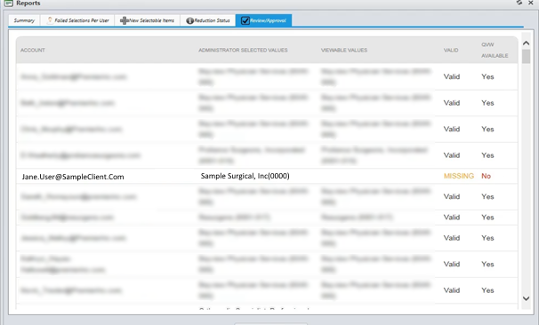{width=100% height=auto}\

Once you check the “review” **check box**, the “Publish to Production” button will be enabled.

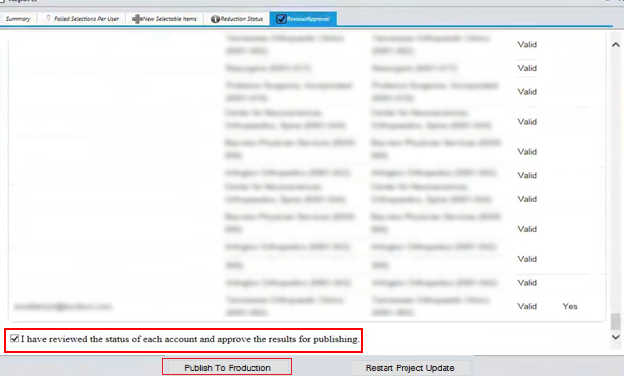{width=100% height=auto}\

At the bottom of the report is the Publish button. Once “Publish to Production” has been clicked, all report information, user information and reduced reports are uploaded to the production server. If the results need to be reprocessed, click the "Restart Project Update" button.  This button will reset the processed data and allow you to upload a new report.

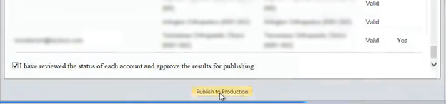{width=100% height=auto}\

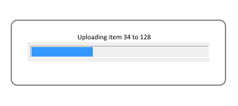{width=100% height=auto}\

This is an example of the successful publishing of a project.

##Viewing a Report

Click on the **View QVW** to launch the report associated with this project.

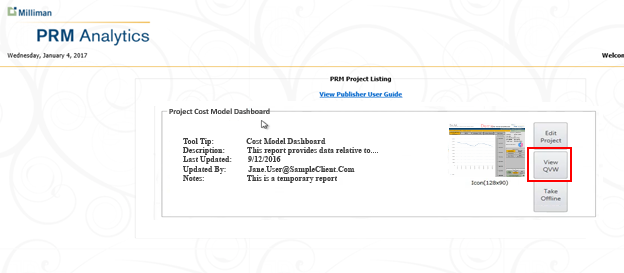{width=100% height=auto}\

##Taking a Report Online/Offline

Click on **Take Offline**. A box will let the user know that using this feature makes the report unavailable to other users.

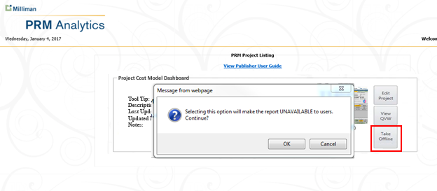{width=100% height=auto}\

##Prevention of Unauthorized Access

Periodically when updating report content, there may be scenarios due to complex data changes and/or reduction failures where sensitive data could be accessible to unintended users after updating. To prevent this, the Client Publisher Console requires the reduction report to be reviewed and acknowledged (review checkbox) before it will allow the operator of the application to push data to the production server. It is important to note that sensitive data is not made live to the end user until the “Push to Production” button is clicked.

This possibility is evaluated after reduction and in the final “Review/Approval” report any data that will be inappropriately accessible to end-users is signified by the red “Previously Not Authorized” notification for the user’s account. The system will attempt to provide information as to the specifics of the inappropriate data by displaying the data contained in the report that is flagged as should not be shown. For the sample report below user Tom User’s report contains information that was not part of the original selections and should not be displayed to the user.

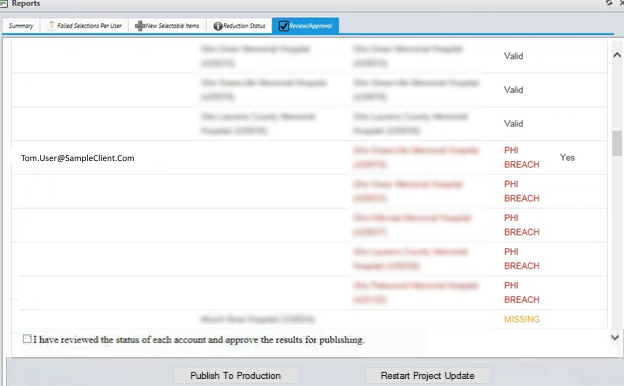{width=100% height=auto}\

If the review checkbox is checked and the **Publish to Production** button is clicked, this report would be **published to the server**. The user - Tom User would be able to see sensitive information that he should not see. However, until the Publish button is pushed, no leakage of sensitive content has occurred as a result of this processing.
