**PRM Release MillFrame 4.1.0**

***PRM Client Administration User Guide ***

Confidential and Proprietary

© 2017 Milliman, Inc. All rights reserved.\
Milliman® is a trademark of Milliman, Inc.\
All other trademarks belong to their respective owners

This manual and its contents are the confidential property of Milliman, Inc. and are prepared for the exclusive use of Milliman, Inc. and its subscribing clients. Any distribution or reproduction, intentional or unintentional, of any materials contained herein without the express written permission of Milliman, Inc. is prohibited.

For additional information, please contact

**Introduction**

Milliman PRM Analytics is a predictive analytics solution that is used to identify potentially avoidable costs in populations under financial risk.

This user guide is designed to give users an understanding of the latest features of the PRM Client Administration Console.

Please note that these instructions are ONLY meant for client users who have been granted access.

**Technical Support**

If you are having any technical difficulty with the product, please contact our technical support team by email: <prm.support@milliman.com>

*Note: For the purpose of this user guide, all data has been de-identified to protect patients personal health information (PHI) in accordance with the Health Insurance Portability and Accountability Act of 1996 (HIPAA).*

Client User Administration Console
----------------------------------

Overview
--------

PRM Client User Administration Console (CUAC) is an application that allows the authorized users (Client Administrators) to add and manage the client users, and set data restrictions for them. The application allows the Client Administrators and users to view the reports restricted data for the group(s) they are associated with.

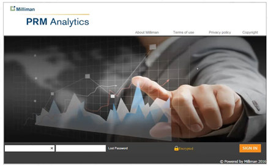{width="4.631205161854768in" height="2.8654254155730534in"}\

-   After logging in, the Client Administrator clicks on a specific report from the drop-down menu. For this demo, we will use the SampleClient group report.

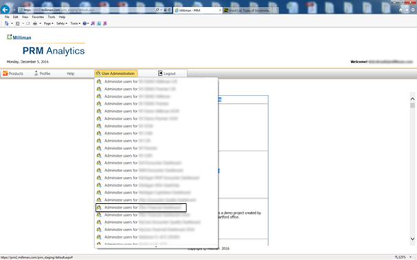{width="6.317725284339457in" height="3.9407600612423446in"}\

-   This is a list of all the users who have access to the in the SampleClient report. The tooltip associated with each user account provides details of the account status.

    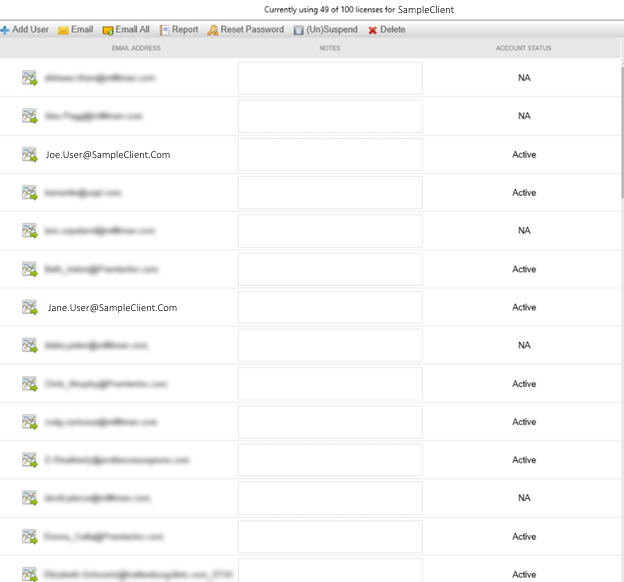{width="6.350516185476815in" height="5.923077427821522in"}\

-   The left hand side displays the users, and also displays their account status.

-   On the right side, the display page is the data restriction selections tree. This is where you restrict client user’s access to the data.

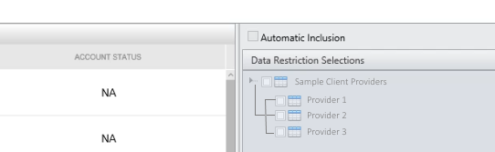{width="5.646621828521435in" height="1.7398261154855643in"}\\`

-   As an example we will select one of the Active client users.

-   When you select a user, the **Data Restriction Selections Tree** is highlighted. Expanding the tree reveals the access that the client user has to different **Providers for the report**. All this information is coming from the QlikView report.

> 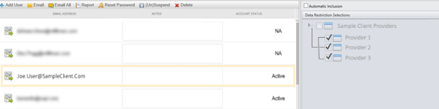{width="6.505016404199475in" height="1.6262543744531934in"}\

-   Clicking on a different client user shows the access that user have to different providers.

> 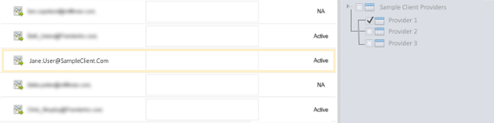{width="6.50167104111986in" height="1.625417760279965in"}\

-   When you want to give or restrict access to data, you check or uncheck the boxes of groups you wish to allow or deny access to.

> 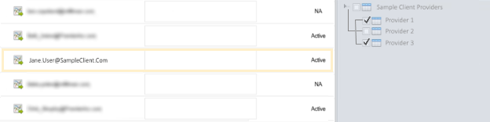{width="6.474916885389327in" height="1.6187292213473317in"}\

-   When you are finished making your selections, click the **Apply Changes** button.

> 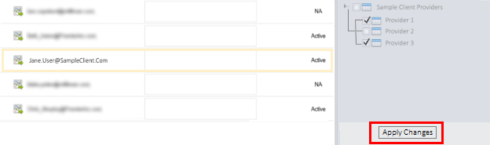{width="6.515049212598425in" height="1.9315452755905511in"}\

-   Modifications to a user’s access rights may take a few moments to process.

    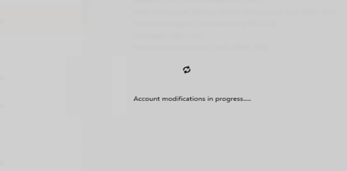{width="5.810542432195976in" height="2.865in"}\

-   When complete, a notification message appears.

> 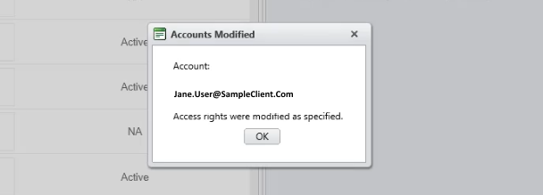{width="6.33421697287839in" height="2.281568241469816in"}\

-   So when Jane User clicks on the Report icon in the Web Portal, they will now have access to the information of both Provider 1 and Provider 2.

> 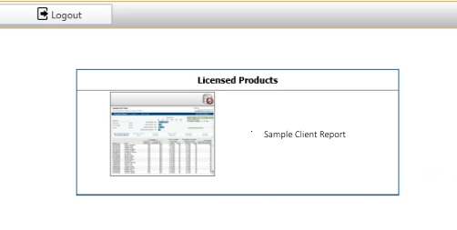{width="5.229896106736658in" height="2.635784120734908in"}\

-   When you click on a user’s status, a dialog box appears that tells an administrator the last time the user accessed the system.

> 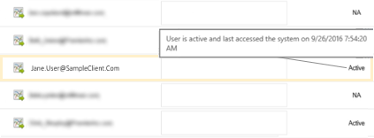{width="4.4525in" height="1.642055993000875in"}\

-   Clicking on other users, different messages appear. Below is a test user message.

> 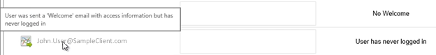{width="6.5in" height="0.8229166666666666in"}\

-   The **No Welcome** status means that the user was not sent a welcome message with instructions on how to access the PRM system. Sometimes the user prefers a customized email on access rather than a generic welcome email (See below in ‘Add User’ section).

> 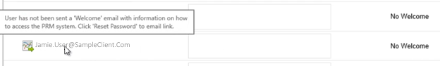{width="6.5in" height="0.9791666666666666in"}\

-   Another user status is **Password Reset**. This means either the **Client Administrator** has reset the password for that user or, the **Client User** could have clicked the **Lost Password** button on the web portal and reset their password.

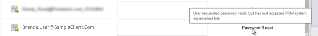{width="6.478334426946632in" height="0.7475in"}\

-   There is also a Notes box, where the Client User Administrator can add notes.

> 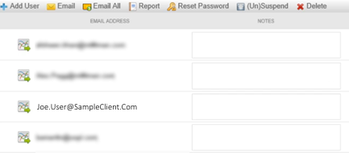{width="4.6490507436570425in" height="2.04in"}\

 Client Administrator Toolbar
-----------------------------

-   The **Delete** button allows the **Client Administrator** to delete a **User**.

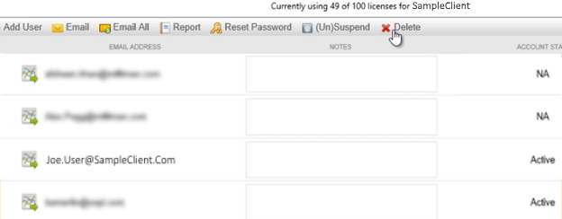{width="6.500905511811023in" height="2.542020997375328in"}\

-   Deleting a user may not delete their account from the system. It means that you have removed their access to this report. They may still have access to other reports. **If this is the only report that they have access to, then it will delete their account.**

-   **Suspend/(Un)suspend** is used to toggle user access by enabling/disabling log in rights.

> {width="6.560284339457568in" height="2.565239501312336in"}\

-   When you click **OK**, it will refresh the screen, it shows that the user’s account has been suspended. When the user’s account has been suspended they are unable to log in to the **Web Portal Application**.

> 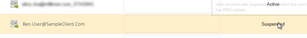{width="6.494615048118985in" height="0.801418416447944in"}\

-   **Reset Password**. Clicking on this button will send a secure link via email to the user for password reset.

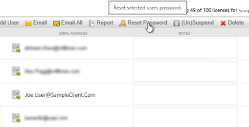{width="5.484315398075241in" height="2.801418416447944in"}\

-   Before sending the email, a confirmation box will ask if you want to send the email.

> {width="4.417283464566929in" height="2.437840113735783in"}\

-   **Email All** builds a list for the client administrator to send out a group email. ***Note: Sometimes the group list is so long that it exceeds the email limit of the email client. So there is a possibility that some users may not receive the blanket email for a large collection of users***

    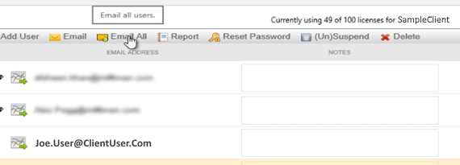{width="5.957446412948381in" height="2.142590769903762in"}\

> 26\. **Email** is used to email an individual user.
>
> 27\. **Add User**.
>
> 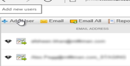{width="2.834254155730534in" height="1.439096675415573in"}\

-   When you click on this button it takes you to a new screen.

> 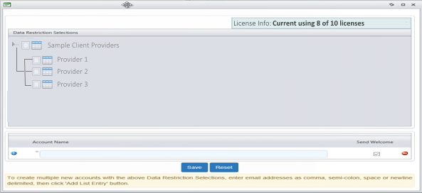{width="6.1779451006124235in" height="2.8337292213473315in"}\

-   This gives you a **Data Restriction Selections Tree** and an Account Name section where you can add a new user.

> 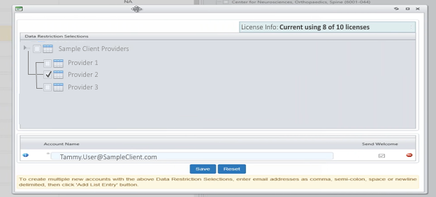{width="6.5in" height="2.9375in"}\

-   After adding the **Account Name** in the box, check “**Send Welcome”** checkbox to send the user an email to access the account, and make the appropriate **Data Restrictions Selections** from the tree. ( selections are optional)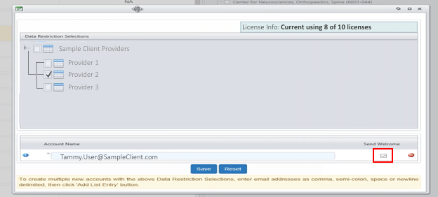{width="6.5in" height="2.9375in"}\

-   Click the **Save** button**. **

    {width="6.5in" height="2.9375in"}\

-   After saving a status message will be displayed as to the results of the request.

-   When you go and look at the individual record to confirm the user addition and data restriction, the status appears as **Password Reset**.

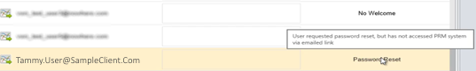{width="5.594530839895013in" height="0.8438681102362204in"}\

-   The reason for this is, new users are always required to change their password on their first visit to the PRM web portal.

> 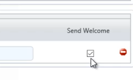{width="2.28125in" height="1.0625in"}\
>
> Example **Send Welcome** email.
>
> ![][29]

-   As an alternative for clients who prefer a manual email reset, you may place a bracket within the account name before hitting **Save** and uncheck **the Send Welcome** box.

> 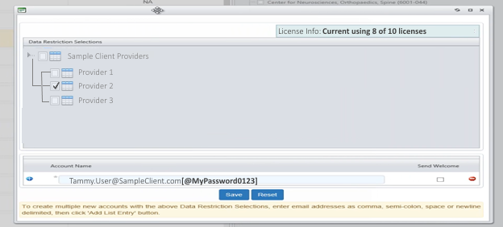{width="6.5in" height="2.9375in"}\

-   This will add the user to the system and then you can send them an email with their new password. This functionality allows accounts to be added without using the PRM “Secure Link” email sent when the “Send Welcome” checkbox is checked.

-   A status message will be displayed with the results of adding the account.

-   Using the + buttons at the bottom left, you can add multiple users.

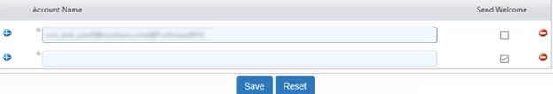{width="6.5in" height="1.1041666666666667in"}\

-   If the user account already exists in the PRM system, adding the account will give the user access to the requested report, along with the settings already present in the PRM system. Thus if the user had access to the Alpha report, when they log into the portal, the user will see both the Alpha report and this report. Note: the users password will not be modified nor will the user receive a PRM email for account modifications (Secure Link email)

-   In the case where the account is “new” to the PRM system – on the users first log in, they will receive this prompt to complete the user profile for their account.

> 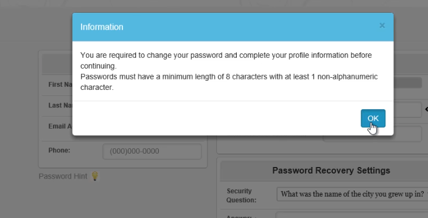{width="6.5in" height="3.3194444444444446in"}\

-   At this point, they will change their password and select a **Security Question** as part of the **Password Recovery Settings**. The selected question will be displayed as part of the “Lost Password” recovery. 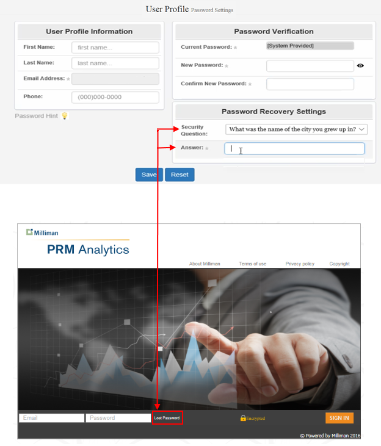{width="6.5in" height="8.333333333333334in"}\

-   Again, here are the **Password Criteria** for all passwords.

> 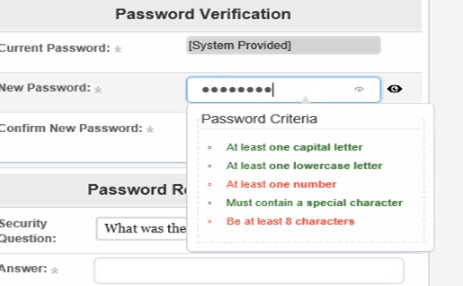{width="5.145390419947507in" height="3.1783628608923884in"}\

-   We will now look at the function of the **Report** tab.

    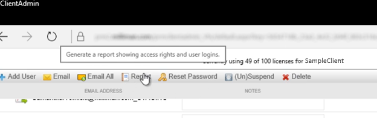{width="6.524822834645669in" height="2.0390069991251094in"}\

-   The first tab shows “**User Access Times”**. This report will show the frequency users have accessed the report in the past 60 days, along with the duration of each access.

-   The next tab is “**User Assignments”**. This tab will display each user account along with the providers associated with each user account.

-   The **“Failed Selections per User”** tab shows selections (providers) that were previously made for the user, however those selections are no longer available in the current data set. This scenario results from variations in the data set between updates of the report.

-   The **“New Selectable Items”** tab is used to show a list of new selections (providers). Due to the nature of changing data sets, for your convenience a list of new selections (providers) is displayed in this list.

-   The maximum number of license for this report, along with the count of utilized license is displayed at the top of the user interface. 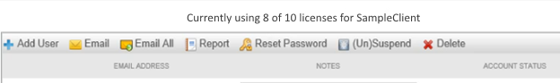{width="6.5in" height="0.96875in"}\

-   Another feature is the check box to only show checked items in the **Data Restriction Selections** tree. 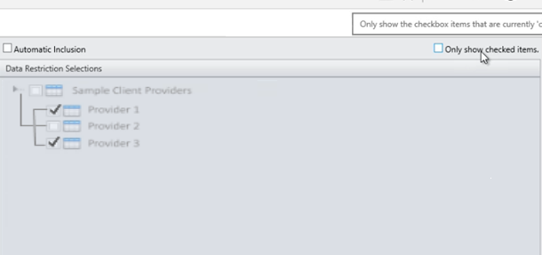{width="6.355053587051619in" height="2.9900010936132984in"}\

-   When clicked, it shows only the items that have been checked on the tree. 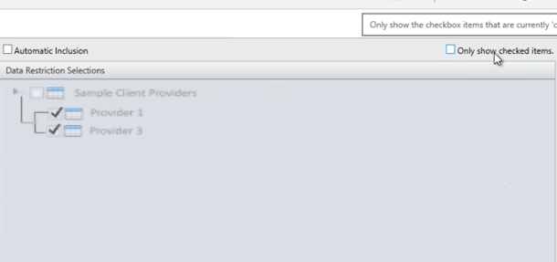{width="6.355053587051619in" height="2.9900010936132984in"}\

-   The final check box is **Automatic Inclusion** box. 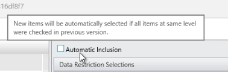{width="3.9375in" height="1.2395833333333333in"}\

***Warning! This is a very dangerous setting - we recommend NOT to use without considering the side effects of it!*** When a new report is published, the system tries to analyze the restrictions tree and will try to automatically add other providers to it based off past selection patterns. If your restrictions tree contains more than 2 levels, the system will maintain a list of intermediate nodes in which all selections (providers) have been selected. If “new” selections (providers) become available in the same intermediate node in which all nodes are selected, the system will automatically select the “new” provider to be included.
