___

##**PRM Release MillFrame 4.2.0**

#***PRM User Administration Console User Guide***

___

Confidential and Proprietary

© 2017 Milliman, Inc. All rights reserved.\
Milliman® is a trademark of Milliman, Inc.\
All other trademarks belong to their respective owners

This manual and its contents are the confidential property of Milliman, Inc. and are prepared for the exclusive use of Milliman, Inc. and its subscribing clients. Any distribution or reproduction, intentional or unintentional, of any materials contained herein without the express written permission of Milliman, Inc. is prohibited.

For additional information, please contact our technical support team by email: <prm.support@milliman.com>

___

##Introduction

Milliman PRM Analytics is a predictive analytics solution capable of identifying potentially avoidable costs in healthcare populations under financial risk.

This user guide is designed to give users an understanding of the latest features of the PRM User Administration console, the functionality of each section and step by step instructions for using the system.

Please note that these instructions are ONLY meant for internal users who have been granted administrator access.

*Note: Access to various functionality is dictated by what was enabled for the role assigned to the user and the options enabled for the client. For illustration purposes, all of the functionality is enabled in the screen shots shown below.*

##Technical Support

If you are having any technical difficulty with the product, please contact our technical support team by email: <prm.support@milliman.com>

*Note: For the purpose of this user guide, all data has been de-identified to protect patients personal health information (PHI) in accordance with the Health Insurance Portability and Accountability Act of 1996 (HIPAA).*

##Overview

Millframe User Administrator Console is an application that allows the Milliman administrators to add and manage users, and set different roles for the users. The global administrators can add, update and delete user’s association to a group. It allows global administrators to add, update and delete Groups and create rules for groups. It also allows to add, update and delete Super Groups, and grant or revoke user permissions as a publisher for a Super Group. The users can search for users, run a query to view the Logged In users, Locked users, Suspended users, and run reports to view the Group Contents etc.

##Logging into the User Administrator Console

Login to the Web Portal using your User Name and Password \[password must be a minimum of 8 characters; one uppercase letter, a number and a special character\]. Enter the security code as shown on the captcha image.

 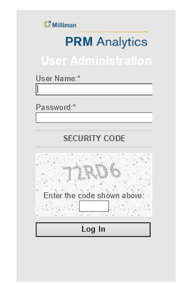{width=30% height=auto}\

After Login, The User Administration – User Account Settings home page will be launched and it has both a tile and scroll down menu of available tasks and interfaces.

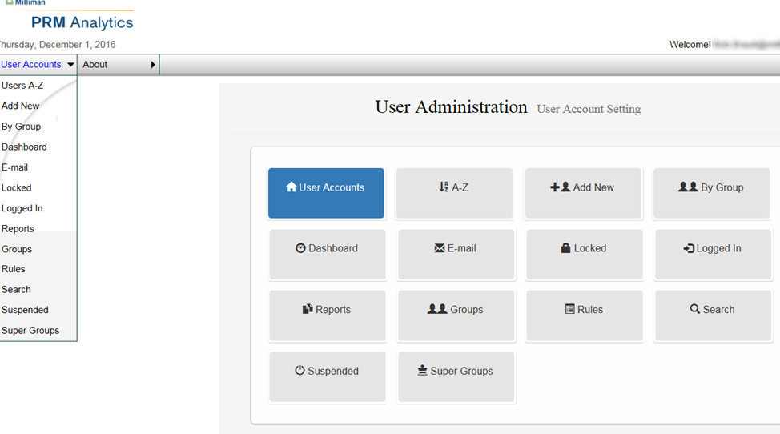{width=100% height=auto}\

The initial view of the user administrator console will present two methods for navigation to other parts of the application. Buttons and a drop down menu – selection of items in the drop down or the buttons will result in navigating to the same pages. If you wish to return the initial view (with buttons) click once on the drop down menu, it will return to the initial page.

##User Accounts

An access point for detailed information about each PRM user.

Sub-sections include, A-Z, Add New, By Group, Dashboard, E-mail, Locked, Logged In, Reports, Groups, Rules, Search, Suspended and Super Groups.

###A-Z

A detailed look-up for all PRM registered users. From this module, single and multiple users may be deleted, approved, unapproved, locked, unlocked, added, removed or deleted from groups.

Administrator can perform look up users using User Name or Email Address and click on **Find Users**, and can click on an alphabet letter to view the list of users that start with a particular letter or can click on All to view all the users. Administrator can select the number of users to show on a page by selecting a value from **Show rows** drop down list. They can also click on buttons **First, Prev, Next, Last** to navigate through different pages.

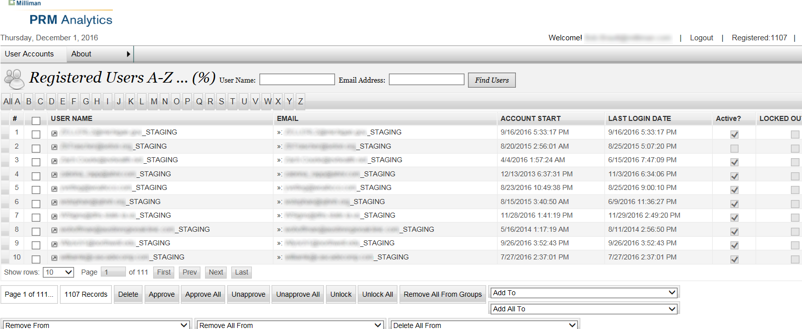{width=100% height=auto}\

In addition to the **All** or **A-Z** tabs, Edit User Details may be accessed by clicking on **User Name** or an email can be sent to a user by clicking on **Email** address. Each record also contains

-   **Account Start**

-   **Last Login Date**

-   **Active (account status) and**

-   **Locked Out?**

Clicking on an individual User Name allows the administrator to reset the user’s password, and edit user details.

Password can be set by emailing a **Secure Link** to a user or **manually**.

-   Click on **Reset Password (Secure Link Email)** button to send user a secure link.\
    or

-   Enter the **New Password** and **Confirm** **New Password**, and click on **Manual Password Reset** button to reset the password manually.

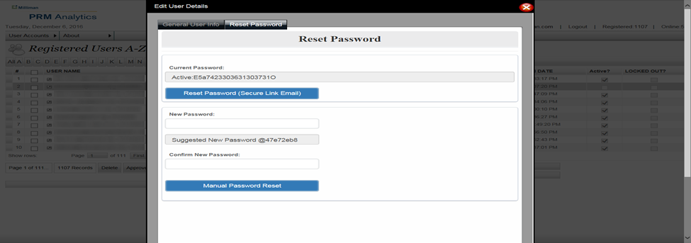{width=100% height=auto}\

Administrator can update user details on **General User Info** page like grant/revoke privileges of a Client User Administrator or Client Publishing Administrator, select/de-select group(s), update email address, unlock or delete a user.

Click on **Save** button to save the changes.

Administrator can click on **Cancel** button to close the window without saving any updates.

User record also contains

-   **User Name**

-   **Active (account status)**

-   **Is Locked Out**

-   **Is Online**

-   **Creation Date**

-   **Last Activity Date**

-   **Last Login Date**

-   **Last Lockout Date, and**

-   **Last Password Changed Date**

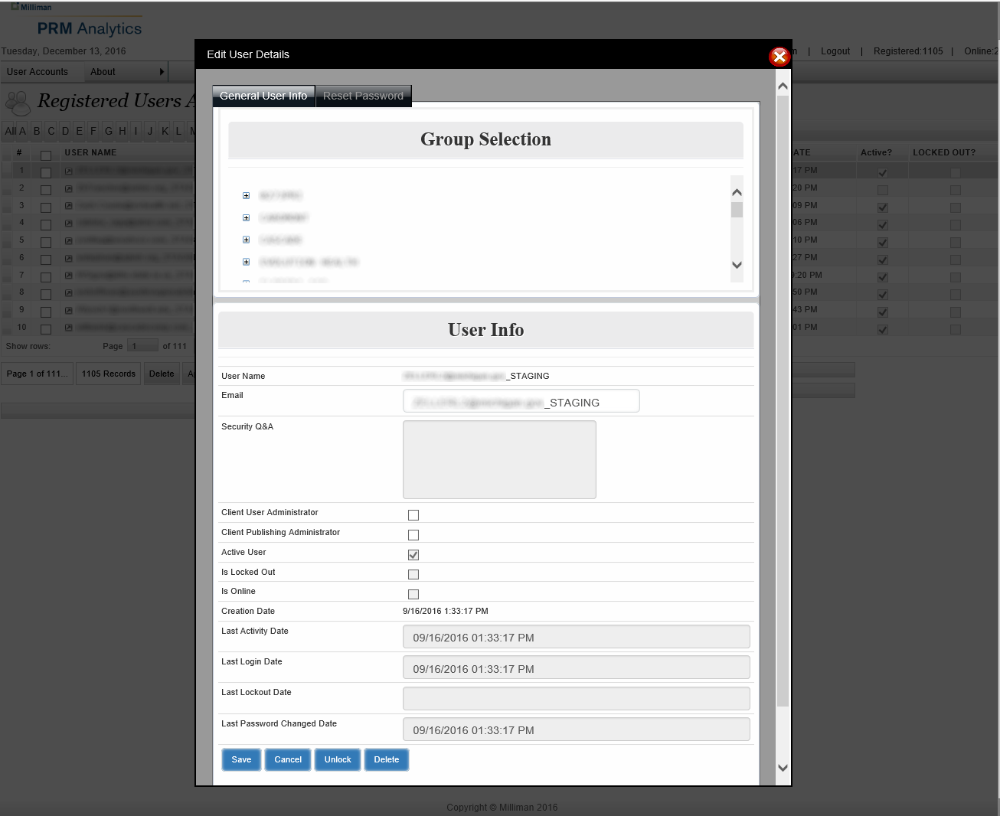{width=100% height=auto}\

###Add New

Another module where administrators can add single or multiple users with groups and using the **CVS list** or **Excel list**. Administrator can check Send Welcome if s/he wants to send a welcome email to the new user.

Clicking on the + button beside the Categories listed in **Group Selection** reveals individual groups associated with each category. From here, users can be added to the group – check the check box to select a group name.

Administrator can click on the **Save** button to create user account(s).

Administrator can click on the **Cancel** button to reset all the fields to their currently stored values.

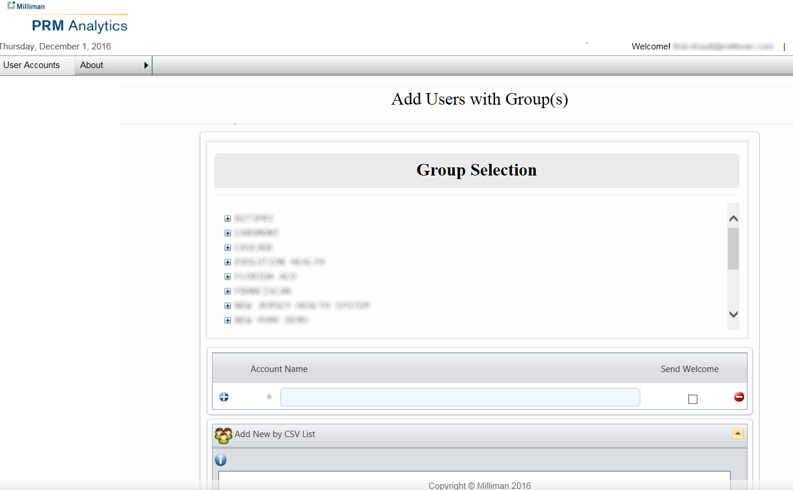{width=100% height=auto}\

Add Single User - Select a group in **Group Selection**, enter **Account Name** and check/uncheck the **Send Welcome** check box.

Add Multiple Users - Select a group in **Group Selection**, enter **Account Name**, click on **+ icon** on the left of the Account Name field and enter 2^nd^ **Account Name** etc., and check/uncheck the **Send Welcome** check box for each account name, if client requires auto generated welcome email. Some clients prefer custom emails, in which case the client-specific protocols should be followed. Check with the product consultant or account manager for client-specific protocols.

Add User by CSV List – Select a group in **Group Selection**, click on bar **Add New by CSV List**, enter the account name and send welcome info as shown in the example below – in \[CSV Format\] or \[Excel Format\]. Click on **Submit List** button. If the checkbox is set to True, the application will send a welcome email otherwise if the checkbox is set to False then no welcome email will be sent to the user.

Here is an example…..

accountname@test.com,True

accountname@test.com,False

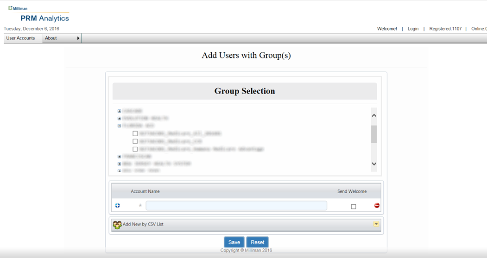{width=100% height=auto}\

###By Group

Another access point to view users by groups – Select a Group from the **Users By Group** drop down list, and look up by User Name and Email Address. The group scroll-down menu features groups listed individually.

-   Here you may select a group to find users within the group.

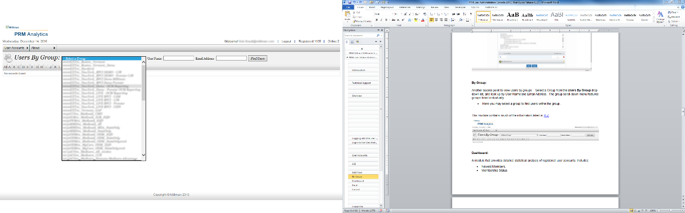{width=100% height=auto}\

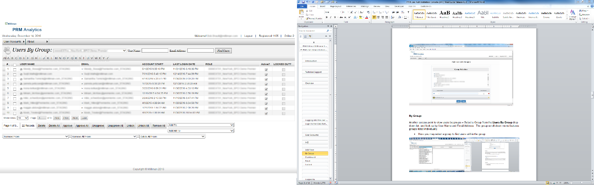{width=100% height=auto}\

This module contains much of the information listed in [A-Z].

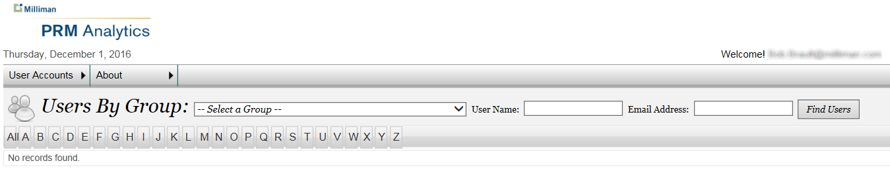{width=100% height=auto}\

###Dashboard

A module that provides detailed statistical analysis of registered user accounts. Includes:

-   Newest Members,

-   Membership Status

-   Latest Logins

-   Last Logged In

-   Membership Registrations, and

-   Groups.

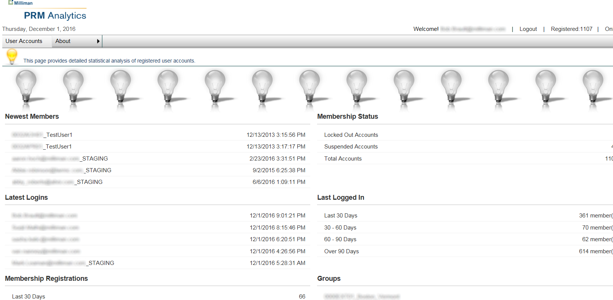{width=100% height=auto}\

###Email

The Email Broadcast module is a place where individual and mass emails from Milliman HCIntel Support may be sent to clients. In addition to the User Names and client email addresses, the date the account started and the last login date are listed.

This module contains much of the information listed in [A-Z].

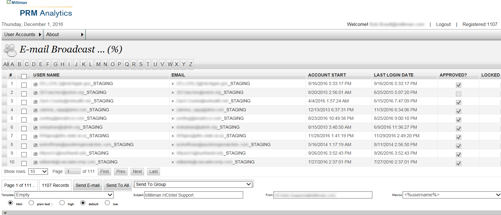{width=100% height=auto}\

###Locked

This section is an access point to locate user accounts that have been locked by an administrator. Administrators can look up users by User Name or Email Address.

This module contains much of the information listed in [A-Z].

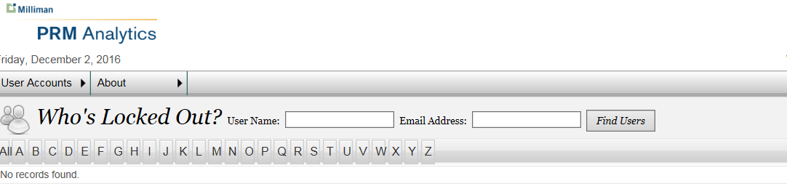{width=100% height=auto}\

###Logged In

This module Shows who is currently logged into Web Portal application. From this module, single and multiple users may be approved, unapproved, locked, unlocked, added or removed from groups. Administrators can look up users by User Name or Email Address.

This module contains much of the information listed in [A-Z].

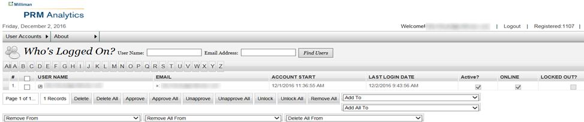{width=100% height=auto}\

Once the User has been accessed by User Name or Email Address, the administrator may click on the drop down menu and remove a single or multiple users from groups.

This module contains much of the information listed in [A-Z].

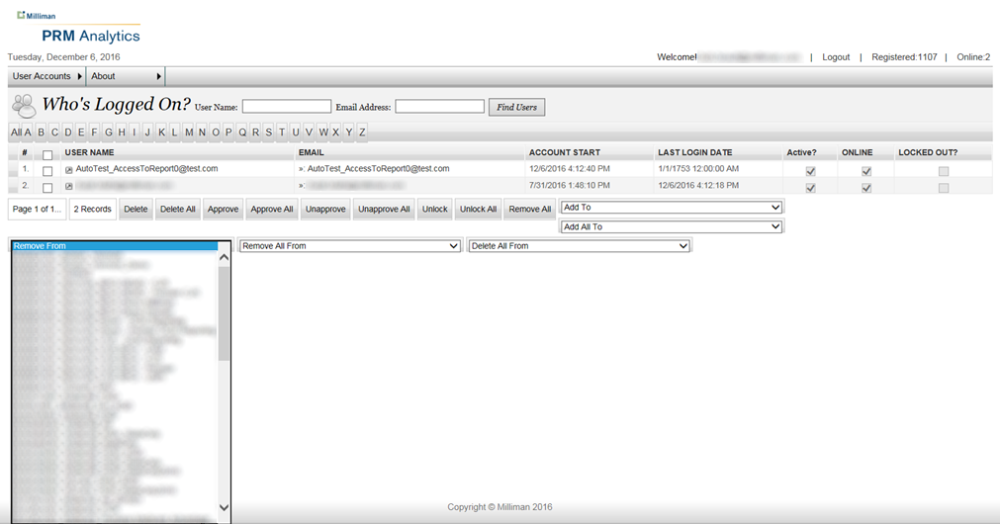{width=100% height=auto}\

###Reports

**Reports** is the module where an administrator user generates reports. Report types include:

-   User/Group

-   User/QVWs

-   Group/Contents

-   QVWs/User

-   QVWs/Group

The user clicks on the **Report Type** and a list of all associated **Users** is generated on screen.

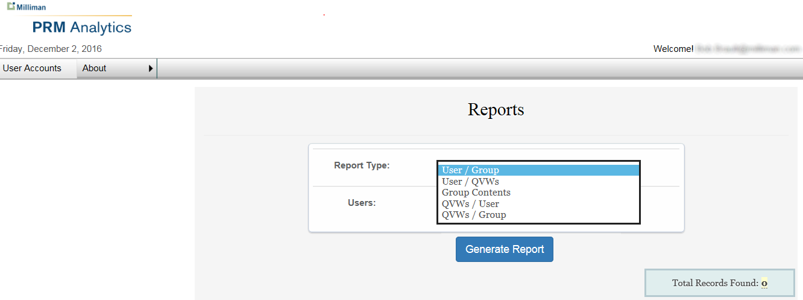{width=100% height=auto}\

In this example, there is one **User** associated with one **Group**.

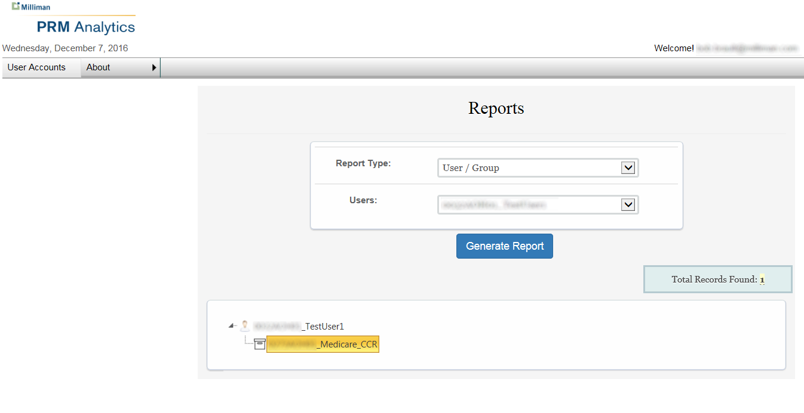{width=100% height=auto}\

Clicking on the file box icon launches the report.

###Examples

Filtering users associated with QVWs

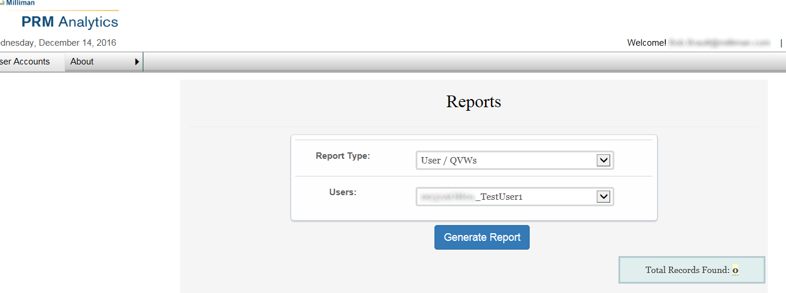{width=100% height=auto}\

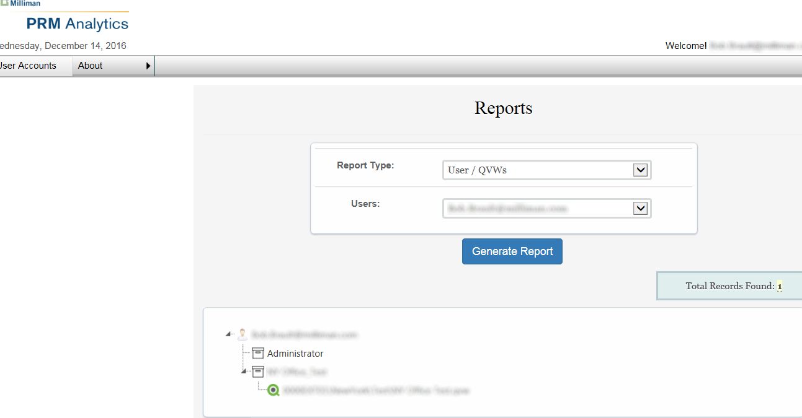{width=100% height=auto}\

In this example, there is one User associated with one QVW.

In the next example, we will generate a report showing Contents of a Group

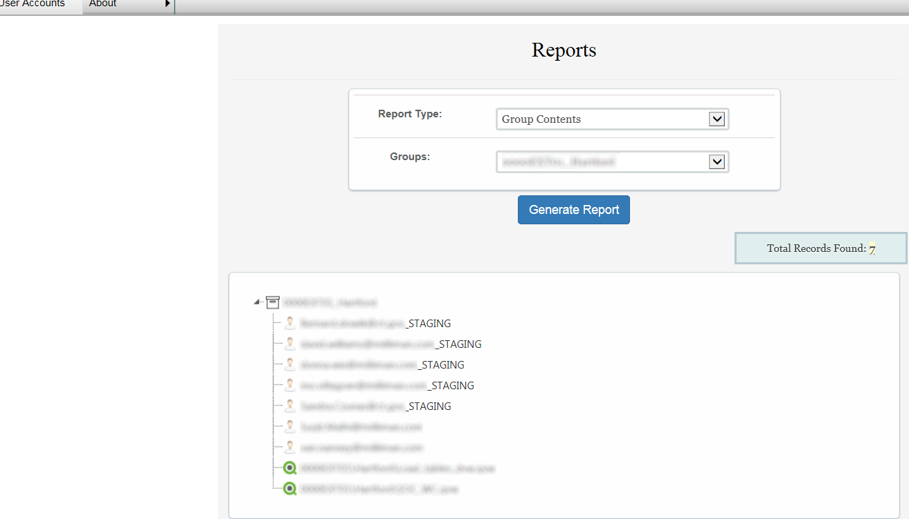{width=100% height=auto}\

In this example, there are 7 Users and 2 Reports contained in the Group.

The next report will show how many Users are associated with a QVW.

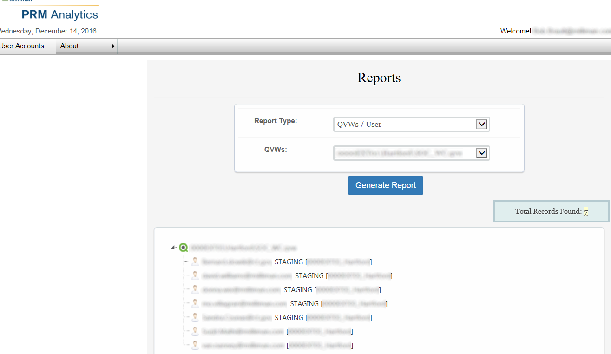{width=100% height=auto}\

In this report, there are 7 Users associated with 1 QVW.

Finally, we will look at how many QVWs are linked to a specific Group.

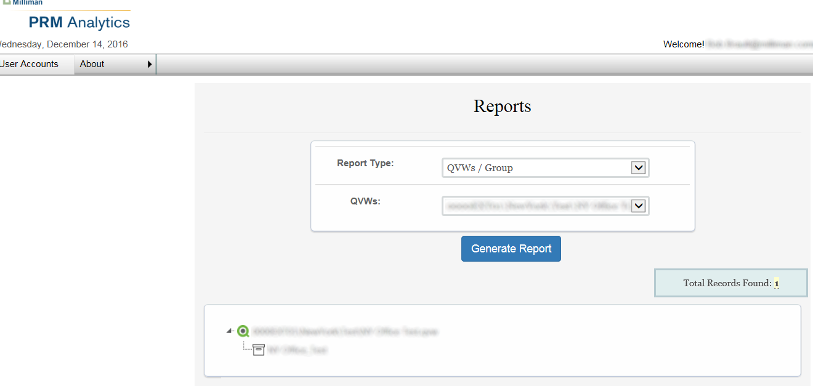{width=100% height=auto}\

As a best practice, in most cases, there will be one QVW linked to each Group.

##Groups

In Groups, the administrator user may add, update or delete a Group. They may add a Friendly Name to the Group. They may also associate Groups to a Category. There are fields for Group Category, Max User Limit and User Count.

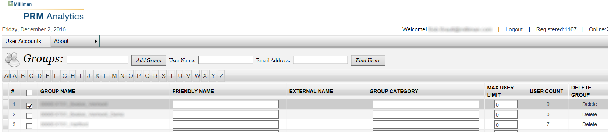{width=100% height=auto}\

###Rules

The **Rules** section is used to manage access rules for the User Web site. Rules are applied to folders, and restrict access. Rules may be added

-   By **Groups**

-   By **Users**

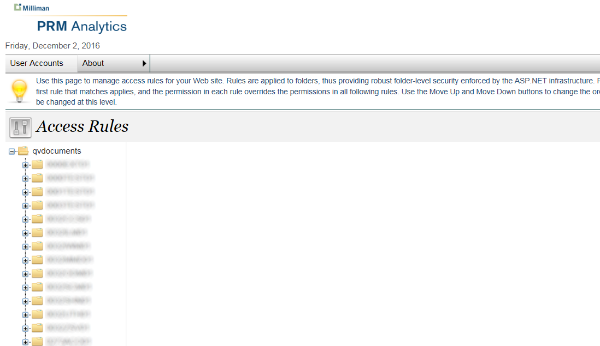{width=100% height=auto}\

Clicking on a rule access folder take the administrator to sub-folders within that contain QVWs.

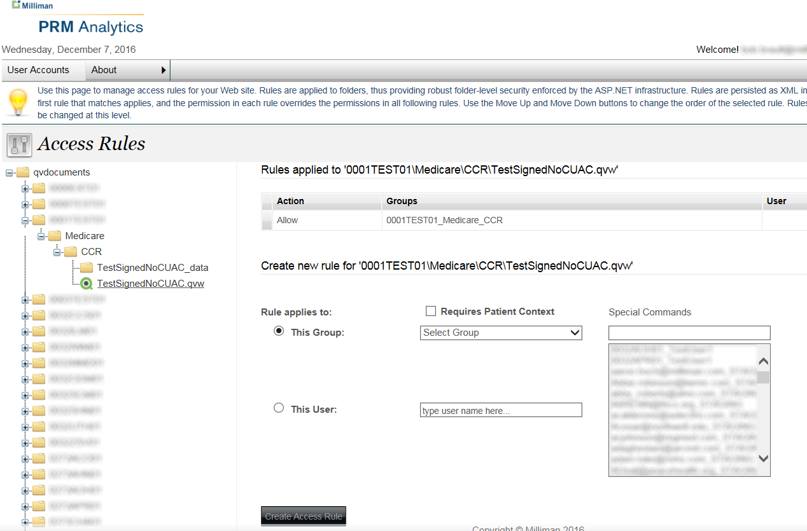{width=100% height=auto}\

###Search

Search is another page used to find Membership by User Name or Email Address.

It has the same fields as [Locked].

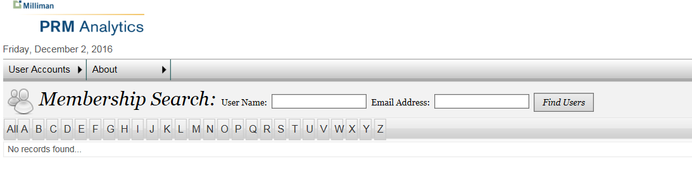{width=100% height=auto}\

###Suspended

This is a page used to look up Suspended or Inactive accounts. From this module, single and multiple accounts may be approved, unapproved, locked, unlocked, added or removed from groups. Users may be accessed by user name or email address. Basically, all the same fields as in the [Logged In] module.

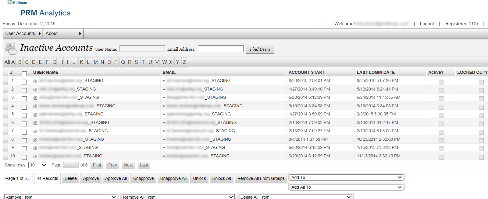{width=100% height=auto}\

###Super Groups

The **Super Groups** module is used to create, modify and add users and grant access permissions to a **Super Group**. ***Note: A user has to be associated with all the groups in a Super Group to be a Publisher for that Super Group.***

**Create** a Super Group – Enter a **Super Group Name** and click on **Create** button. Click on **Apply Changes** button to save the newly created super group.

**Delete** a Super Group – Select a **Super Group Name** in **Available Super Groups**, and click on **Delete** button. Click on **Apply Changes** button.

*Note; In order to make any additions, deletions or changes permanent, you must hit the **Apply Changes** button.*

Clicking on the **Available Super Group** brings up a list of the **Groups** attached to the **Super Group**, **All groups in the PRM system**, **All client admins with group access**, and **All client publishers with group access** information.

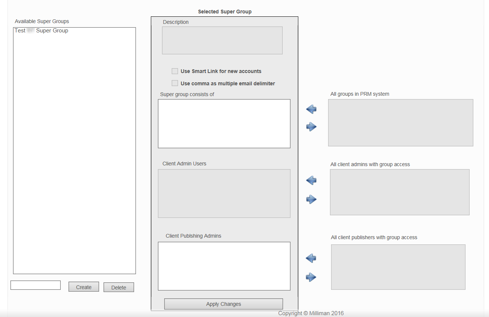{width=100% height=auto}\

Arrow buttons allow the administrator to add or remove groups to the **Super Group**, and add and remove Client Admins (future functionality), and Client Publishers access to the **Super Group**. Note; **Set a user as a Client Administrator for a Super Group** functionality will be available in future release.

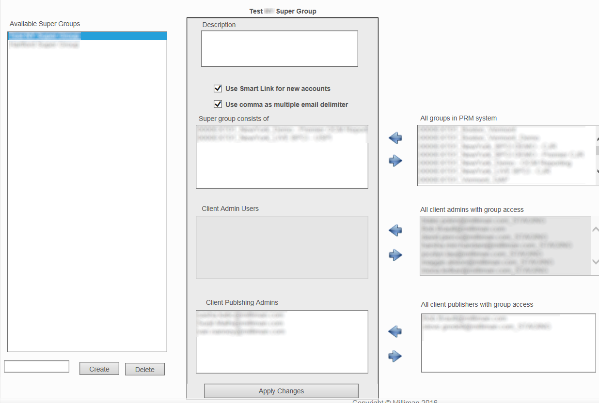{width=100% height=auto}\

***Note: If a group has access to multiple reports, it will not appear in the box,** **All Groups in PRM System. ***
