___

##**PRM Release MillFrame 4.1.0**

#***Web Portal User Guide***

___

Confidential and Proprietary

© 2017 Milliman, Inc. All rights reserved.\
Milliman® is a trademark of Milliman, Inc.\
All other trademarks belong to their respective owners

This manual and its contents are the confidential property of Milliman, Inc. and are prepared for the exclusive use of Milliman, Inc. and its subscribing clients. Any distribution or reproduction, intentional or unintentional, of any materials contained herein without the express written permission of Milliman, Inc. is prohibited.

For additional information, please contact our technical support team by email: <prm.support@milliman.com>

___

##Introduction

Milliman PRM Analytics is a predictive analytics solution that can be used to identify potentially avoidable healthcare costs in populations under financial risk.

This user guide is designed to give users an understanding of the PRM Web Portal.

##Technical Support

If you are having any technical difficulty with the product, please contact our technical support team by email: <prm.support@milliman.com>

*Note: For the purpose of this user guide, all data has been de-identified to protect patient’s personal health information (PHI) in accordance with the Health Insurance Portability and Accountability Act of 1996 (HIPAA).*

##PRM Web Portal

###Overview

The PRM Web Portal is an application that allows the client users to view the reports for the group(s) they are associated with. The application also allows the Client User Administrators to launch Client User Administration Console application, and the Client Publishers to launch Client Publisher Console application.

Access to the Client User Administration Console and the Client Publisher Console requires special rights. If the menu items are not visible in the web portal once successfully logged in – your account has not been granted rights for access to the additional PRM components.

In compliance with HIPAA, the PRM web portal will automatically log out the user after a period of user inactivity as determined by HIPAA regulations.

Password complexity rules are governed by HIPAA regulations and apply to user password creation for new accounts and password resets.

###Web Portal Users

There are 3 kinds of user permissions of the PRM Web Portal:

-   Client Users

-   Client User Administrators

-   Client Publisher Administrators

A user’s access to various features described in this guide will depend on the user’s permissions

###Client User

-   Login to the Web Portal \[password must be a minimum of 8 characters; one uppercase letter, a number and a special character\].

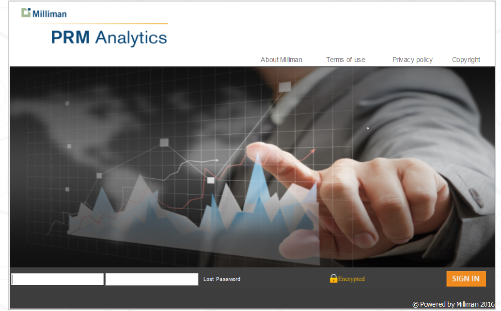{width=100% height=auto}\

-   After logging in you see the **Web Portal console**.

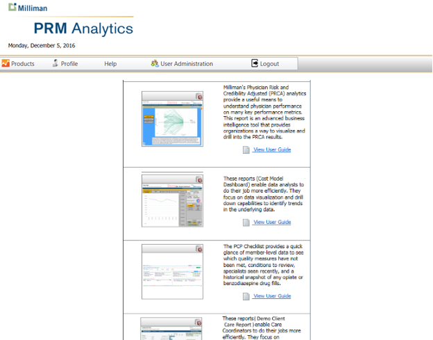{width=100% height=auto}\

-   Clicking on **Products** will reveal a list of reports available to licensed users.

-   Clicking on the individual report icon will launch that report.

-   Clicking on the “**View User Guide**” link will display the user guide associated with the report. Not all reports have an associated user guide.

-   In the event that a user receives the “**Report Not Available**” icon for a report, they should send a support request to **PRM Support** by email: <prm.support@milliman.com> to inquire why they cannot see the report.

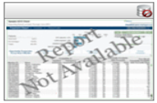{width=20% height=auto}\

-   Clicking on the **Profile** tab allows a user to view their account profile information, including name, email address, phone number and password recovery settings including security questions.

-   You may also use the profile to change your password.

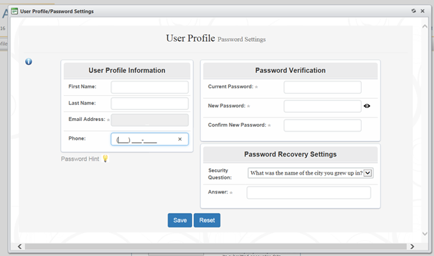{width=100% height=auto}\

-   Moving your mouse over the “Help” menu item will display three additional items in the dropdown.

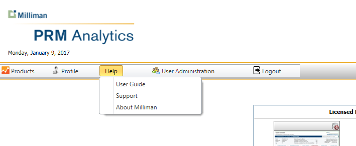{width=100% height=auto}\

-   The first item “User Guide” displays the document you are reading.

-   Clicking on the “Support” link will launch your default email client to send an email to the PRM Support Team - at <prm.support@milliman.com>

-   The “About Milliman” item will navigate to the Milliman home page.

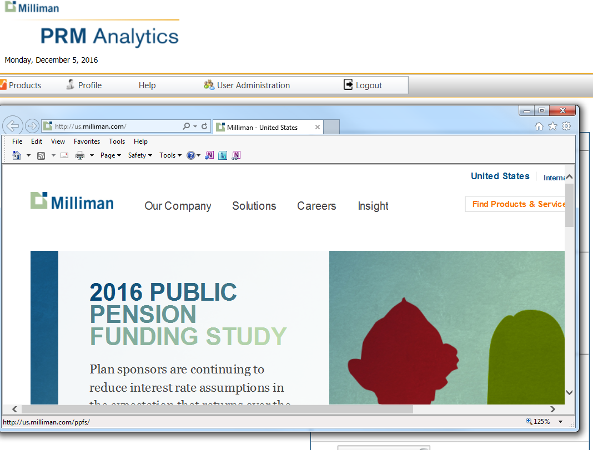{width=100% height=auto}\

-   Clicking on the **User Administration** menu item will navigate the user to the Client User Administration Console - if user is authorized to administer only one group otherwise if the user is authorized to administer multiple groups then clicking on the **User Administration** menu item gives the user a scroll down list of groups the user has permission to administer.

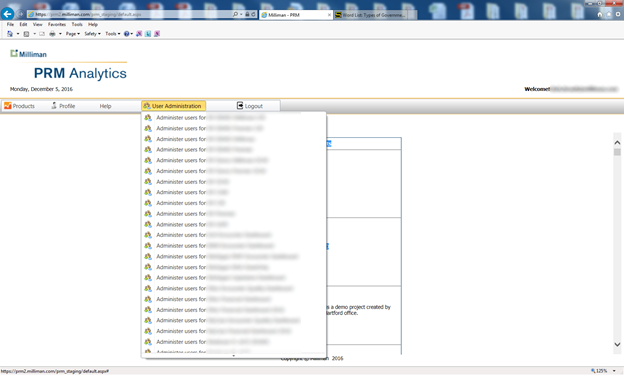{width=100% height=auto}\

-   Clicking on the **Publish Content** tab will navigate the user to the Client Publisher Console if the user is authorized to publish contents for only one group otherwise if the user is authorized to publish contents for multiple groups then clicking on **Publish Content** tab gives the user a scroll down list of groups the user has permission to publish content for.

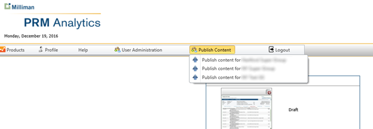{width=100% height=auto}\

-   Finally, **Logout** allows the user to log out of the PRM Web Portal Console, and return to the initial login screen which contains links to the **Milliman** web site. **Terms of Use**, **Privacy Policy**, and **Copyright** disclaimers.

###Using the Lost Password Feature

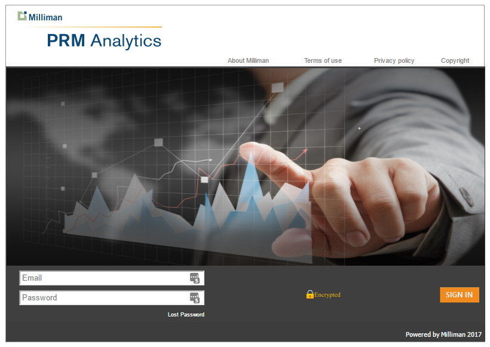{width=100% height=auto}\

-   Should a user fail to log in as the result of forgetting their password, they click on the **Lost Password** link.

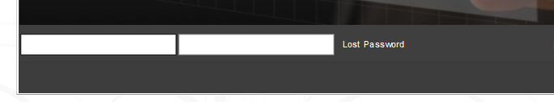{width=100% height=auto}\

-   The user is prompted to enter their email. Then click **Next**.

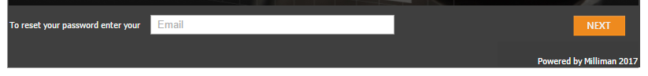{width=100% height=auto}\

-   The user will then be prompted to answer the security question. (Selected by user when profile screen was completed).

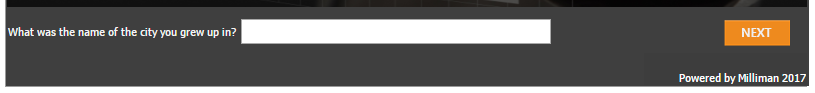{width=100% height=auto}\

-   If the security questions is correctly answered - the user is sent an email and a link that prompts the user to change their password and check **Profile** information as well as completing the **Password Recovery** settings, including a **Security Question**.

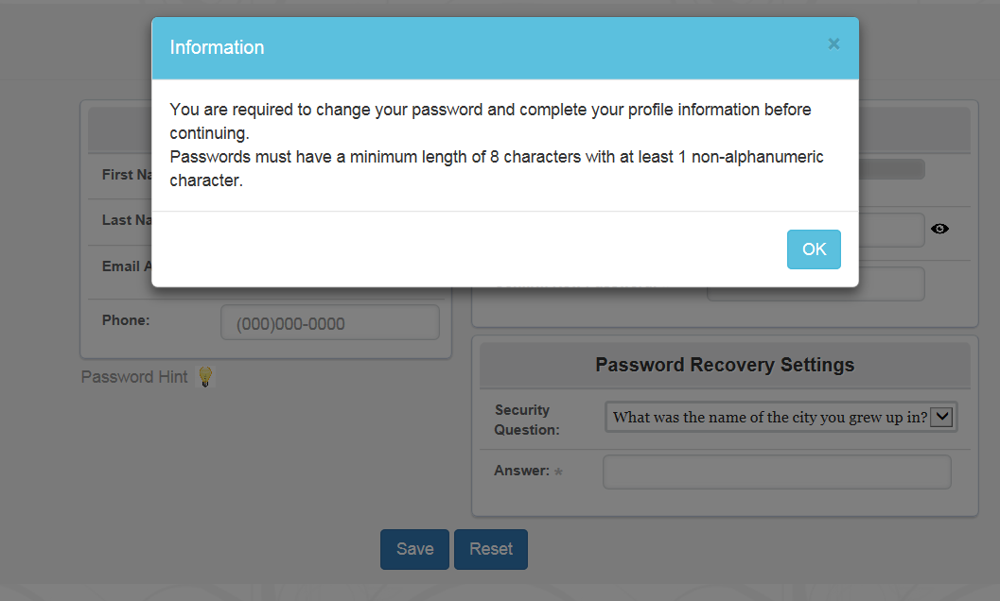{width=100% height=auto}\

-   After filling out all fields, hit the **Save** button.

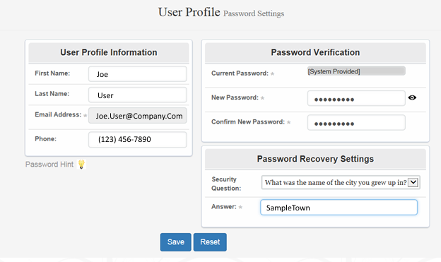{width=100% height=auto}\

The User may then Log in to the Web Portal.
